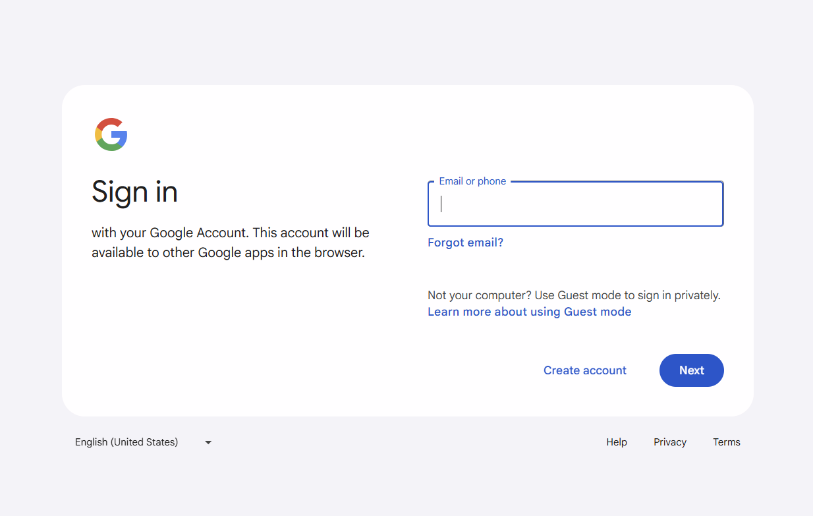

# 🔒 Google Login Page Clone

یک شبیهسازی واکنشگرا از صفحه ورود گوگل با قابلیتهای مدرن و طراحی دقیق.

[](https://abolfazl-javadi-fard.github.io/Google-login-page/)




## 🌟 ویژگیهای کلیدی
- **طراحی دقیق**: تطابق ۹۹% با طرح اصلی گوگل
- **واکنشگرا**: سازگاری با تمام دستگاهها (موبایل، تبلت، دسکتاپ)
- **تعاملی**: 
  - اعتبارسنجی فرم در لحظه
  - انیمیشنهای روان
  - حالتهای هایلایت هنگام هاور
- **امن**: شبیهسازی مکانیزمهای امنیتی گوگل

## 🛠 فناوریهای استفاده شده
| فناوری | نسخه | کاربرد |
|---------|-------|--------|
|  HTML5 | - | ساختار اصلی |
|  CSS3 | - | استایلدهی پیشرفته |
|  JavaScript | ES6+ | منطق تعاملی |
| [Google Icons](https://fonts.google.com/icons) | آخرین نسخه | آیکونها |
| 
## 🚀 شروع سریع
### پیشنیازها
- مرورگر مدرن (Chrome 80+, Firefox 75+)
- ویرایشگر کد (VS Code پیشنهاد میشود)

### نصب و اجرا
```bash
# 1. کلون کردن ریپو
git clone https://github.com/Abolfazl-Javadi-Fard/Google-login-page.git

# 2. ورود به دایرکتوری پروژه
cd Google-login-page

